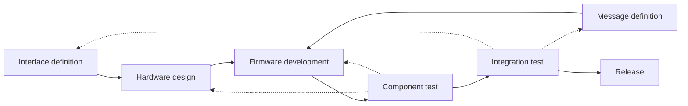

# Development

## Overview

### Development Environment

開発するためには，以下をインストールする必要があります．

- [Git](https://git-scm.com/)
- [KiCad](https://kicad.org/)
- [VS Code](https://code.visualstudio.com/)
    - [PlatformIO IDE extension](https://platformio.org/install/ide?install=vscode)
- [Python](https://www.python.org/downloads/)(optional)
    - [uv](https://docs.astral.sh/uv/)(optional)

### Repository Structure

Repositoryの構成は以下の通りです．

```text
├── README.md
├── docs/               # Documentation
├── firmware/           # PlatformIO project
│   ├── platformio.ini
│   ├── include/
│   ├── lib/
│   ├── src/
│   │   └── main.cpp
│   └── test/
│
├── hardware/           # Hardware design
│   ├── circuit/        # KiCad project
│   └── library/        # Shared KiCad library
│
└── tools/              # PC-side debug tools
    ├── scripts/
    ├── src/
    └── logs/
```


## Development Workflow

### Overview

開発は反復的なプロセスで進みます。インターフェースの定義、ハードウェア設計、メッセージの定義、およびファームウェアは、単体テストや統合テストの結果に基づいて修正される場合があります。



### Interface definition

CAN FDやUARTなどの外部との通信インターフェイスの仕様を決めます。ここでインターフェイスの定義を変更した場合はチームのルールに従って[KiCadの共有ライブラリ](https://github.com/TeamMeltingPoppo/KiCadLibrary)を更新する必要があります。

### Message definition

どのデータをシステム上で送受信するかを決めます。ここでmessageの定義を変更した場合はチームのルールに従って[mavlink-dialect](https://github.com/TeamMeltingPoppo/mavlink-dialect) を更新する必要があります。


### Hardware design

MCUやセンサなどの部品を選定し、回路図や基板の設計を行います。外部との通信インターフェイスはInterface definitionで決めた仕様に従って設計します。

詳細は[hardware design](./hardware.md)を参照してください。

### Firmware development

MCUのソフトウェア開発を行います。外部と送受信するデータはMessage definitionで決めた仕様に従って実装します。外部との通信インターフェイスはInterface definitionで決めた仕様に従って実装します。

詳細は[firmware development](./firmware.md)を参照してください。

### Component test

動作確認のための単体テストを行います。外部との通信インターフェイスはInterface definitionで決めた仕様に従ってテストします。外部と送受信するデータはMessage definitionで決めた仕様に従ってテストします。また、取得したデータ等が要求仕様を満たしているかを確認します。

場合によっては、Hardware designやFirmware developmentの段階に戻って修正を行う必要があります。

Pythonのdebugツールを使用して、PC側からの通信で単体テストを行うこともできます。詳細は[debug tool](./tools.md)を参照してください。

### Integration test

他の基板やPC側のソフトウェアと接続して、システム全体としての動作確認を行います。外部との通信インターフェイスはInterface definitionで決めた仕様に従ってテストします。外部と送受信するデータはMessage definitionで決めた仕様に従ってテストします。また、取得したデータ等が要求仕様を満たしているかを確認します。

場合によっては、Interface definitionやMessage definitionの段階に戻って修正を行う必要があります。

Pythonのdebugツールを使用して、PC側からの通信で疑似的に統合テストを行うこともできます。詳細は[debug tool](./tools.md)を参照してください。

## Team Rules

### MAVLink Dependencies

- 現行の[mavlinkのdialect](https://github.com/TeamMeltingPoppo/mavlink-dialect)に即したバージョンのmavlinkに関連したライブラリを使用してください．

    - firmwareの開発では，[mavlink-cpp](https://github.com/TeamMeltingPoppo/mavlink-cpp)を使用してください．
    - pythonのdebugツールの開発では，[mavlink-python](https://github.com/TeamMeltingPoppo/mavlink-python)を使用してください．

- mavlink dialectが変更されたときは，それぞれのプロジェクトはmavlinkに関連するライブラリの依存関係を更新する必要があります．
    - 依存関係の更新は，Renovateを使用して自動化することができます．

### Hardware Interfaces

- CANのコネクタのような，他の基板と接続するためのインターフェイスは，共有ライブラリ(`hardware/library/`)のものを使用してください．
- 共有libraryに存在しない部品が必要な場合は、共有部品として追加する必要があるか検討してください．
- 既存の共有部品をプロジェクト側で独自に複製・変更しないでください．
    - 共有部品の変更が必要な場合は，まず共有ライブラリに対してPull Requestを作成してください．
