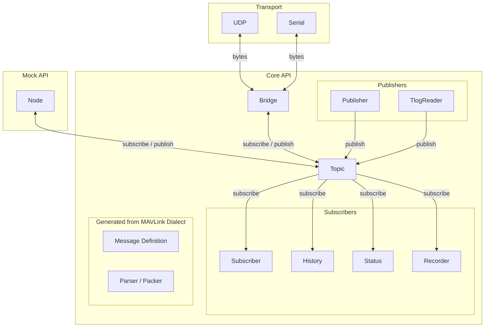

# Debug Tools

## ディレクトリ構成

```text
tools/
├── .gitignore      # Git ignore file
├── .python-version # Python version file
├── pyproject.toml  # Python project configuration
├── README.md       #  Readme file
├── uv.lock         # uv dependency lock file
├── .venv/          # Virtual environment for debug scripts
├── .vscode/        # VSCode settings
├── scripts/        # Debug scripts
├── src/            # Source code
└── logs/           # Log files
```

scriptsディレクトリには、デバッグ用のスクリプトが格納されています。scriptsディレクトリ内のスクリプトは、.gitignoreによりGit管理から除外されています。必要に応じて.gitignoreを編集し、Git管理下に置くことも可能です。


## mavlink-python

MAVLinkのメッセージを送受信するためのPythonライブラリです。MAVLinkメッセージの定義、通信、メッセージの配信、アプリケーションによる処理を分離した構成になっています。

